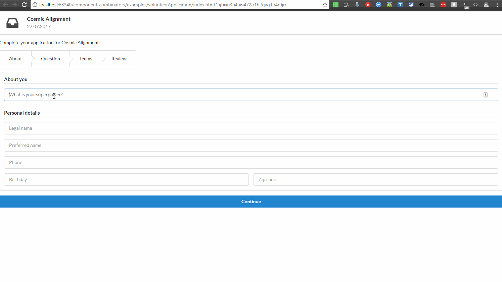

# Motivation
This demo aims at showing how state machines can be used to modelize reactive systems, in 
particular user interfaces. They have long been used for embedded systems, in particular for 
safety-critical software.

We will use a real case of a multi-step workflow (the visual interface however has been changed, 
but the logic is the same). A user is applying to a volunteering opportunity, and to do so 
navigate through a 5-step process, with a specific screen dedicated to each step. When moving 
from one step to another, the data entered by the user is validated then saved asynchronously.
 
That multi-step workflow will be implemented in two iterations :
 
- In the first iteration, we will do optimistic saves, i.e. we will not wait or check 
for a confirmation message and directly move to the next step. We will also fetch data remotely 
and assume that fetch will always be successful (call that optimistic fetch). This will helps us 
showcase the definition and behaviour of an extended state machine.
- In the second iteration, we will implement retries with exponential back-off for the initial 
data-fetching. We will also implement pessimistic save for the most 'expensive' step in the 
workflow. This will in turn serve to showcase an hierarchical extended state machine.

With those two examples, we will be able to conclude by recapitulating the advantages and 
trade-off associated to using state machines for specifying and implementing user interfaces. 

The implementation uses `cyclejs` as framework, and [`state-transducer`](https://github.com/brucou/state-transducer#example-run) as a state machine library.

# General specifications
Here are the initial specifications for the volunteer application workflow, as extracted from the
 UX designers. Those initial specifications are light in details, and are simple lo-fi wireframes.


In addition, the following must hold :

- it should be possible for the user to interrupt at any time its application and continue it 
later from where it stopped
- user-generated data must be validated
- after entering all necessary data for his application, the user can review them and decide to 
modify some of them, by returning to the appropriate screen (cf. pencil icons in the wireframe)

# First iteration
## Modelizing the user flow with an extended state machine
On the first iteration, the provided wireframes are refined into a workable state machine, which 
reproduces the provided user flow, while addressing key implementation details (error flows, data
 fetching).


The behaviour is pretty self-explanatory. The machines moves from its initial state to the fetch 
state which awaits for a fetch event carrying the fetched data (previously saved application 
data). From that, the sequence of screens flows in function of the user flow and rules 
defined.

Note that we could have included processing of the fetch event inside our state machine. We could
 have instead fetched the relevant data, and then start the state machine with an initial 
 INIT event which carries the fetched data. Another option is also to start the state machine 
 with an initial extended state which includes the fetched data.



## Tests
### Test strategy
It is important to understand that the defined state machine acts as a precise specification for 
the reactive system under development. The model is precise enough to double as implementation for 
that reactive system (partial implementation, as our model does not modelize actual actions, nor 
 the interfaced systems, e.g. HTTP requests, the network, etc.), but is primarily a specification
  of the system under study. In the context of this illustrative example, we used our state 
   transducer library to actually implement the specified state machine.
  
 It ensues two consequences for our tests :
 - the effectful part of the reactive system must be tested separately, for instance during 
 end-to-end or acceptance tests
- assuming that our library is correct (!), **testing the implementation is testing the model**, 
as the correctness of any one means the correctness of the other.

We thus need to test the implementation to discover possible mistakes in our model. The only way 
to do this is manually : we cannot use the outputs produced by the model as oracle, as they are 
precisely what is being tested against. Hence test generation and execution can be automated, but
 test validation remains manual.
  
That is the first point. The second point is that the test space for our implementation consists 
of any sequence of events admitted by the machine (assuming that events not accepted by the 
machine have the same effect that if they did not exist in the first place : the machine ignores 
them). That sequence is essentially infinite, so any testing of such reactive system necessarily 
involves only a finite subset of the test space. How to pick that subset in a way to generate a minimum 
**confidence** level is the crux of the matter and conditions the testing strategy to adopt.

Because our model is both specification and implementation target, testing our model 
involves **testing the different paths in the model**[^1]. Creating  
the abstract test suite is an easily automatable process of simply traversing through the states and
transitions in the model, until the wanted model coverage is met. The abstract test suite can be 
reified into executable concrete test suites, and actual outputs (from the model implementation) 
are compared manually to expected outputs (derived from the informal requirements which originated 
the model).

[^1]: Those paths can be split into control paths and data paths (the latter relating to the set of 
values the extended state can take, and addressed by [**data coverage** criteria](http://www.cse.chalmers.se/edu/year/2012/course/DIT848/files/06-Selecting-Tests.pdf)). We will 
address only the control paths. 

Miscellaneous model coverage criteria[^2] are commonly used when designing a test suite with the 
help of a model:

- **All states coverage** is achieved when the test reaches every state in the model
at least once. This is usually not a sufficient level of coverage, because behavior
faults are only accidentally found. If there is a bug in a transition between a
specific state pair, it can be missed even if all states coverage is reached.
- **All transitions coverage** is achieved when the test executes every transition in
the model at least once. This automatically entails also all states coverage.
Reaching all transitions coverage doesn’t require that any specific sequence is
executed, as long as all transitions are executed once. A bug that is revealed
only when a specific sequence of transitions is executed, is missed even in this
coverage level. The coverage can be increased by requiring :
- **All n-transition coverage**, meaning that all possible transition sequences of `n` or more 
transitions are included in the test suite.
- **All path coverage** is achieved when all possible branches of the underlying model graph are 
taken (**exhaustive** test of the control structure). This corresponds to the previous coverage 
criteria for a high enough `n`
- **All one-loop path**, and **All loop-free paths** are more restrictive criteria focusing on 
loops in the model


[^2]: Bin99 Binder, R. V., Testing object-oriented systems: models, patterns, and
    tools. Addison-Wesley Longman Publishing Co., Inc., Boston, MA,
    USA, 1999.

Using a dedicated [graph testing library](https://github.com/brucou/graph-adt), we computed the 
abstract test suite for the *All one-loop path* criteria and ended up with around 1.500 tests!! 
We reproduce below extract of the abstract test suite:
 
 - A test is specified by a sequence of inputs 
 - Every line below is a the sequence of control states the machine go through based on the 
 sequence of inputs it receives. Note that you can have repetition of control states, anytime a 
 transition happens between a state and itself. Because we have used a *All one-loop path* 
 criteria to enumerate the paths to test, every `Team_Detail` loop corresponds to a different 
 edge in the model graph. Here such loop transitions could be `Skip Team` or `Join Team (valid 
 form)` or `Join Team (invalid form)`. We can see from the extract how the graph search works 
 (depth-first search).

```javascript
["nok","INIT_S","Review","About","Review","Question","Review","Teams","Team_Detail","Team_Detail","Team_Detail","Team_Detail","Teams","Review","State_Applied"], 
["nok","INIT_S","Review","About","Review","Question","Review","Teams","Team_Detail","Team_Detail","Team_Detail","Teams","Review","State_Applied"], 
["nok","INIT_S","Review","About","Review","Question","Review","Teams","Team_Detail","Team_Detail","Team_Detail","Team_Detail","Teams","Review","State_Applied"], 
["nok","INIT_S","Review","About","Review","Question","Review","Teams","Team_Detail","Team_Detail","Team_Detail","Teams","Review","State_Applied"], 
["nok","INIT_S","Review","About","Review","Question","Review","Teams","Team_Detail","Team_Detail","Teams","Review","State_Applied"], 
["nok","INIT_S","Review","About","Review","Question","Review","Teams","Team_Detail","Team_Detail","Team_Detail","Team_Detail","Teams","Review","State_Applied"], 
["nok","INIT_S","Review","About","Review","Question","Review","Teams","Team_Detail","Team_Detail","Team_Detail","Teams","Review","State_Applied"], 
["nok","INIT_S","Review","About","Review","Question","Review","Teams","Team_Detail","Team_Detail","Teams","Review","State_Applied"], 
["nok","INIT_S","Review","About","Review","Question","Review","Teams","Team_Detail","Teams","Review","State_Applied"], 
["nok","INIT_S","Review","About","Review","Question","Review","Teams","Review","State_Applied"], 
["nok","INIT_S","Review","About","Review","Question","Review","State_Applied"], 
["nok","INIT_S","Review","About","Review","Question","Question","Review","Teams","Team_Detail","Team_Detail","Team_Detail","Team_Detail","Teams","Review","State_Applied"],
... 
["nok","INIT_S","Review","State_Applied"]
["nok","INIT_S","About","Question","Teams","Team_Detail","Team_Detail","Team_Detail","Team_Detail","Teams","Review","About","Review","Question","Review","State_Applied"],
["nok","INIT_S","About","Question","Teams","Team_Detail","Team_Detail","Team_Detail","Team_Detail","Teams","Review","About","Review","Question","Question","Review","State_Applied"],
["nok","INIT_S","About","Question","Teams","Team_Detail","Team_Detail","Team_Detail","Team_Detail","Teams","Review","About","Review","State_Applied"],
...
["nok","INIT_S","Question","Teams","Team_Detail","Team_Detail","Team_Detail","Team_Detail","Teams","Review","About","Review","Question","Review","State_Applied"],
["nok","INIT_S","Question","Teams","Team_Detail","Team_Detail","Team_Detail","Team_Detail","Teams","Review","About","Review","Question","Question","Review","State_Applied"],
["nok","INIT_S","Question","Teams","Team_Detail","Team_Detail","Team_Detail","Team_Detail","Teams","Review","About","Review","State_Applied"],
["nok","INIT_S","Question","Teams","Team_Detail","Team_Detail","Team_Detail","Team_Detail","Teams","Review","About","About","Review","Question","Review","State_Applied"],
...(1000+ lines)

```


### Test selection 
As we mentioned, even for a relatively simple reactive system, we handed up with 1.000+ tests to 
exhaust the paths between initial state and terminal state, and that even with excluding n-loops.

We finally selected only 4 tests from the **All path coverage** set, for a total of around 50 
transitions :

```javascript
["nok","INIT_S","About","About","Question","Question","Teams","Team_Detail","Team_Detail","Team_Detail","Team_Detail","Teams","Review","Question","Question","Review","About","About","Review","State_Applied"],
["nok","INIT_S","Question","Teams","Team_Detail","Team_Detail","Team_Detail","Team_Detail","Teams","Review","State_Applied"],
["nok","INIT_S","Teams","Team_Detail","Team_Detail","Team_Detail","Team_Detail","Teams","Review","State_Applied"],
["nok","INIT_S","Review","Teams","Team_Detail","Team_Detail","Team_Detail","Team_Detail","Teams","Review","State_Applied"] 

```

Those tests :

- fulfill the *All transitions coverage* criteria: 4 input sequences are sufficient
- involves all the loops in the model graph (cf. first test sequence)
- insist slightly more on the core functionality of the system, which is to apply to volunteer 
teams (e.g. `TEAM_DETAIL` loop transitions)
  - the transition space for that control state is the permutations of `Join(Invalid Form) x Skip x 
  Join(Valid Form)`, with `|set| = 2` for `Join` and `Skip` (an event triggering the associated 
  transition happens or not). We have `|Join(Invalid Form) x Skip x Join(Valid Form)| = 8`, so 
  `3! x 8 = 48` transition permutations for that control state. Rather than exhaustively testing 
  all permutations, we pick 4 of them, fit into the 4 input sequences that are necessary to cover
  the model.

In summary the process is :

- we have informal UI requirements which are refined ino a state-machine-based 
detailed specification 
- we generate input sequences and the corresponding output sequences, according to some 
model coverage criteria, our target confidence level and our testing priorities (happy path, 
error path, core scenario, etc.)
- we validate the selected tests manually

### Test implementation
Once test sequences are chosen, test implementation is pretty straightforward. Because state 
transducers from our library are causal functions, i.e. function whose outputs depend exclusively
 on past inputs, it is enough to feed an freshly initialized state machine with a given sequence 
 of inputs and validate the result sequence of outputs.

cf. test repository

### Integration tests
Note that once the model is validated, we can use it as an oracle. This means for instance that we 
can take any input sequence, run it through the model, gather the resulting outputs, generate the
 corresponding BDD test, and run them. Most of this process can be automatized.

### Data coverage
A validated model can be used to generate randomized input sequences. To that purpose the input 
sequence must be parameterized, and the 

 - the set of validated tests can be cherry picked, parameterized and used to generate higher 
 coverage of the extended state of the state machine model, this time with an oracle derived from
  the result of the non-parameterized version of the test. **TODO explain bettr**
 
We will use the state machine as a model, and automatically generate input tests from it.
**explain EFSM should add some data-flow testing, i.e. generators which randomizes the data - or
 randomize between a predefined set**

### Test execution

**coming soon I swear**

References :

- [Model Based Testing - An Evaluation](http://www.diva-portal.org/smash/get/diva2:831658/FULLTEXT01.pdf)
  - advantages and disadvantages of MBT
  - Sometime it happens that a behavioral model contains error. So the model must be debugged! 
  prior to generate tests
- [](http://www.axini.com/wp-content/uploads/Ver17Model-Based-Unit-Testing-using0ADecision-Tables.pdf)
  - advantages of MBT, more succintly presented
  - model-based testing process
  - 3.3.3 Function specifications - difference between model-driven (use for specification i.e. 
  implementation) and model-based (used for testing for instance, does not need same level of 
  details)
  -  Testing strategy ; coverage etc.
  - in general a pretty clearly explained thesis, even if the decision tables approach (2017 
  rally?) seems inferior to me to state machine modelling

## Implementation
We use the stream-oriented `cyclejs` framework to showcase our [state machine library](https://github.com/brucou/state-transducer). To that purpose, we use the `makeStreamingStateMachine` from our library to match a stream of actions to a stream of events. 
We then wire that stream of actions with cyclejs sinks. In this iteration, we make use of two 
 drivers : the DOM driver for updating the screen, and a domain driver for fetching data. 
 
Code available in [dedicated branch](https://github.com/brucou/cycle-state-machine-demo/tree/first-iteration).
 
 ## Run
Check-out the branch on your local computer then type `npm run start` in the root directory for 
that branch.

# Second iteration
**coming soon**
